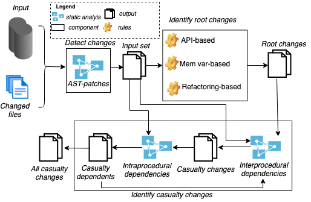

### CacCADe's workflow 

CasCADe is a tool to automatically detect casualty changes. An overview of its workflow can be found in the figure below. 

### CasCADe's Code

The full code for CasCADe can be found [here](https://github.com/anonymouscascade/cascade.github.io/raw/gh-pages/Code.zip). The jar file and its dependencies can be found [here](https://github.com/anonymouscascade/cascade.github.io/raw/gh-pages/target.zip). The code file, when uncompressed, contains a readme file that explain the code 

### Casualty Changes Evaluation 

The evaluation data for CasCADe and casulaty changes can be found [here](https://github.com/anonymouscascade/cascade.github.io/raw/gh-pages/EvaluationData.zip). The uncompressed file contains a detailed readme file that explains every part. 
